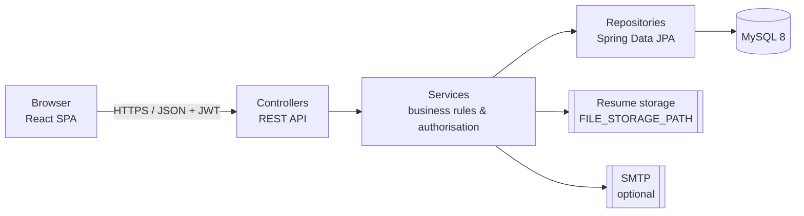
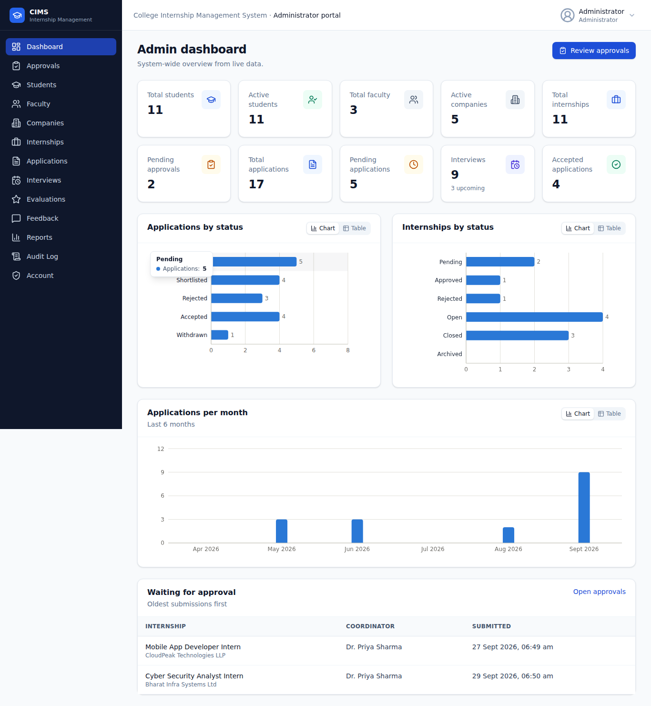
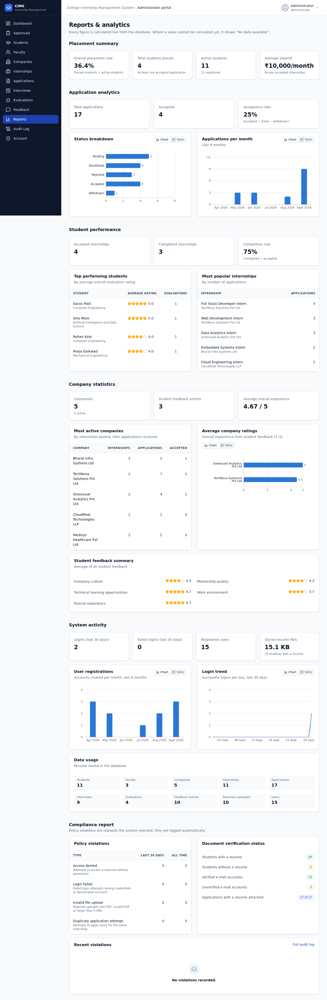
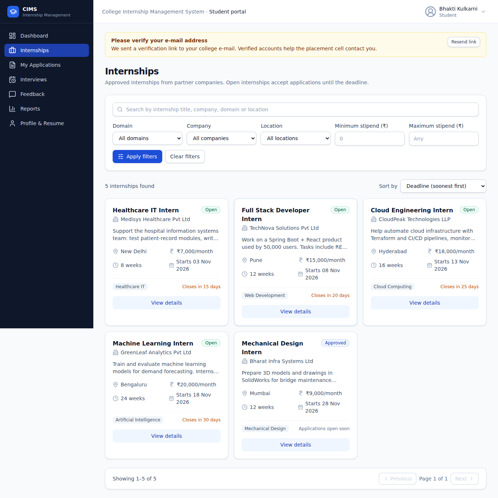
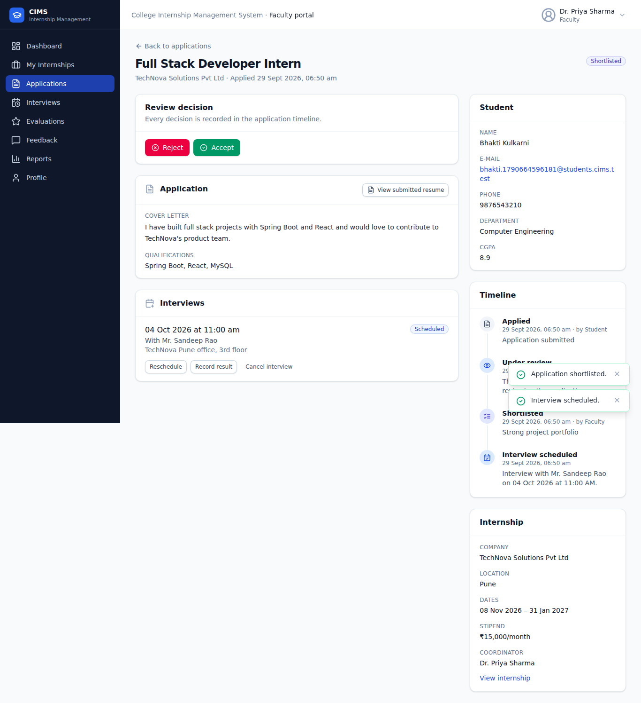
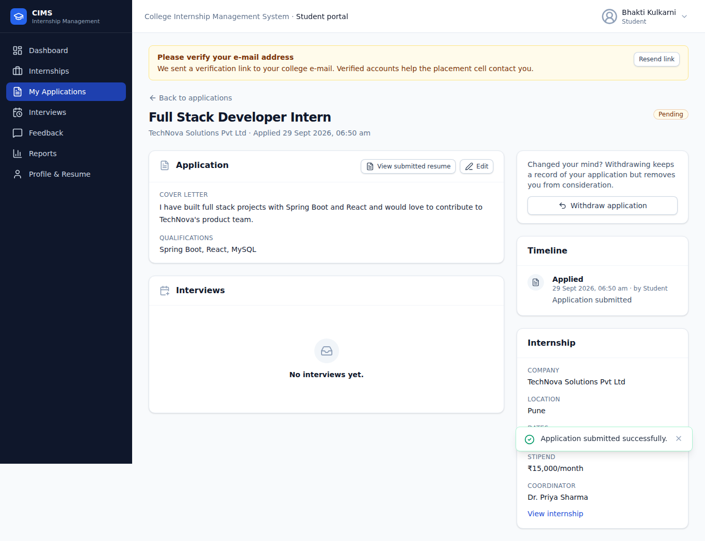
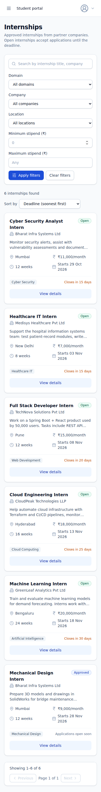

# College Internship Management System (CIMS)

A web platform for a college's Training & Placement cell that manages the whole internship
lifecycle — from student registration to internship completion, feedback and reports — with
separate portals for **administrators**, **faculty coordinators** and **students**.

```
Registration → Profile & resume → Discover internships → Apply → Review → Shortlist
  → Interview → Result → Evaluation → Completion → Feedback → Reports
```

---

## Contents

- [Project overview](#project-overview)
- [Features](#features)
- [User roles](#user-roles)
- [Technology stack](#technology-stack)
- [Architecture](#architecture)
- [Database](#database)
- [Installation](#installation)
- [Environment variables](#environment-variables)
- [Running the backend](#running-the-backend)
- [Running the frontend](#running-the-frontend)
- [API documentation](#api-documentation)
- [Testing](#testing)
- [Deployment](#deployment)
- [Screenshots](#screenshots)
- [Project team](#project-team)
- [License](#license)

## Project overview

Colleges often track internships in spreadsheets, e-mail threads and paper forms, so it is hard
to know which students applied where, what stage they reached, or how good an internship was.
CIMS replaces this with one system:

- faculty post internships for partner companies and the administrator approves them;
- students browse approved internships, apply with their resume and track every step;
- faculty review applications, schedule interviews, record results and evaluate interns;
- students, companies and faculty give structured feedback;
- dashboards and reports are computed live from the MySQL database — nothing is hard-coded.

## Features

**Accounts & security**
- Student self-registration; faculty/admin accounts created by the administrator
- JWT authentication, BCrypt password hashing, role-based authorisation on every endpoint
- Password policy (8+ characters, upper, lower, number, special), unique normalised e-mails
- E-mail verification (SMTP, or logged links in development) and admin verification override
- Account activation / deactivation (no hard deletes), change password
- Audit log of logins, admin actions and rejected requests (policy violations)

**Internships**
- Company management with CIN/LLPIN registration-number validation and uniqueness
- Faculty create internships → admin approves/rejects (with remarks) → coordinator opens applications
- Controlled statuses: PENDING, APPROVED, REJECTED, OPEN, CLOSED, ARCHIVED; automatic closing after the deadline
- Duration derived from dates (4 weeks – 6 months), deadline before start, future dates enforced
- Server-side search (title, company, domain, location), filters (domain, company, location, stipend range), sorting and pagination

**Applications & interviews**
- Mandatory PDF resume (extension, MIME type and PDF signature checked; max 5 MB); each application keeps a snapshot
- One application per student per internship (database `UNIQUE` + backend check + clear message)
- Workflow PENDING → SHORTLISTED → ACCEPTED / REJECTED, student withdrawal (kept as WITHDRAWN)
- Timeline built only from stored events (applied, under review, shortlisted, interview scheduled/completed/cancelled, accepted, completed)
- Interviews: schedule, reschedule, record result, cancel — at least 24 hours' notice, not in the past, not after the application deadline

**Evaluation & feedback**
- Faculty evaluations on six criteria + overall rating (whole numbers 1–5)
- Student feedback on companies, company feedback on interns (recorded by staff), faculty quality feedback, platform feedback with admin triage

**Reports**
- Admin: placement summary, application analytics, student performance, company statistics, system activity, compliance
- Faculty: posted internships, application review, evaluations, interview statistics
- Student: my applications, interview schedule, placement status
- Charts with a table view; "No data available" instead of invented numbers

**User experience**
- Responsive layout (sidebar on desktop, drawer on mobile, scrollable tables)
- Consistent design system: cards, badges, forms with inline validation, modals, confirmations for destructive actions, toasts, skeletons, empty and error states
- Keyboard-accessible dialogs, labelled form fields, visible focus

## User roles

| Role | Can do |
|------|--------|
| **Admin** | Manage students, faculty and companies; approve/reject internships; monitor applications, interviews and evaluations; manage feedback; view all reports and the audit log |
| **Faculty** | Post and manage own internships; review applications; shortlist/accept/reject; schedule and manage interviews; evaluate interns; record company feedback; give quality feedback; faculty reports |
| **Student** | Register; maintain profile and resume; browse/filter internships; apply, edit or withdraw; track status and timeline; view interviews and results; give feedback; student reports |

Companies do not log in; administrators manage them and faculty record their feedback.

## Technology stack

| Layer | Technology |
|-------|------------|
| Frontend | React 19, JavaScript, Vite, Tailwind CSS 4, React Router, Axios, Recharts, lucide-react icons |
| Backend | Java 17, Spring Boot 3.5 (Web, Data JPA/Hibernate, Security, Validation, Mail), Maven |
| Authentication | JWT (jjwt), BCrypt |
| Database | MySQL 8 |
| Testing | JUnit 5, Spring MockMvc, H2 (MySQL mode), Postman |
| Tooling | Git/GitHub, GitHub Actions CI, Docker, VS Code, MySQL Workbench |

## Architecture



```
backend/src/main/java/com/cims/
├── config/       security, CORS, clock, async, admin bootstrap, typed properties
├── controller/   REST endpoints (thin: validation + delegation)
├── service/      business logic, workflows, ownership checks, reports
├── repository/   Spring Data repositories, specifications, report queries
├── entity/       JPA entities and enums (controlled values)
├── dto/          request/response records (entities are never exposed)
├── security/     JWT service and filter, 401/403 handlers
├── validation/   custom annotations and date/interview rules
├── exception/    exception types and the global error handler
└── util/         paging, text and transaction helpers

frontend/src/
├── components/   ui (design system), charts, domain components
├── pages/        auth, student, faculty, admin, shared pages
├── layouts/      dashboard and auth layouts, navigation
├── services/     Axios client and API modules
├── context/      authentication and toast contexts
├── hooks/        data loading, debounce, titles
├── routes/       route table and guards
└── utils/        constants, formatting, validation
```

## Database

Normalised MySQL schema with 15 tables — `users`, `students`, `faculty`, `companies`,
`internships`, `applications`, `application_status_history`, `interviews`, `evaluations`,
`student_feedback`, `company_feedback`, `faculty_feedback`, `system_feedback`, `audit_logs`,
`email_verification_tokens` — using primary/foreign keys, `UNIQUE`, `NOT NULL` and `CHECK`
constraints, indexes and UTC timestamps. See [`database/README.md`](database/README.md) and the
ER diagram in [`docs/PROJECT_DOCUMENTATION.md`](docs/PROJECT_DOCUMENTATION.md#13-er-diagram).

## Installation

> **New to the project? Follow [`docs/RUN_IN_VSCODE.md`](docs/RUN_IN_VSCODE.md)** — a step-by-step
> guide for running everything in VS Code on Windows (also covers Mac/Linux), with troubleshooting.

Prerequisites: **Java 17+** (21 recommended), **Node.js 20+** (22 recommended), **MySQL 8**.
Maven does not need to be installed — use the included Maven Wrapper (`mvnw` / `mvnw.cmd`).

```bash
git clone https://github.com/<your-account>/<your-repo>.git
cd <your-repo>

# 1. Database (see database/README.md for details)
mysql -u root -p -e "CREATE DATABASE cims CHARACTER SET utf8mb4 COLLATE utf8mb4_unicode_ci;"
mysql -u root -p -e "CREATE USER 'cims_app'@'localhost' IDENTIFIED BY 'choose-a-password'; GRANT SELECT, INSERT, UPDATE, DELETE ON cims.* TO 'cims_app'@'localhost';"
mysql -u root -p cims < database/schema.sql
mysql -u root -p cims < database/seed.sql            # development data only
mkdir -p backend/uploads/seed && cp database/seed-files/sample-resume.pdf backend/uploads/seed/

# 2. Configuration
cp backend/.env.example backend/.env                  # then edit DB_PASSWORD and JWT_SECRET
cp frontend/.env.example frontend/.env.local
```

Development sample accounts (from `seed.sql`, **development only**):
`admin@cims.test / Admin@123`, `priya.sharma@cims.test / Faculty@123`,
`aarav.patil@students.cims.test / Student@123`.

## Environment variables

Backend (`backend/.env` locally; hosting dashboard in production — never commit real values):

| Variable | Required | Default | Description |
|----------|----------|---------|-------------|
| `DB_URL` | yes | local MySQL | JDBC URL, e.g. `jdbc:mysql://host:3306/cims?sslMode=REQUIRED&serverTimezone=UTC` |
| `DB_USERNAME` / `DB_PASSWORD` | yes | `cims_app` / — | Database credentials |
| `JWT_SECRET` | yes | — | ≥ 32 random characters (`openssl rand -base64 48`); the app refuses to start without it |
| `JWT_EXPIRATION_MINUTES` | no | `480` | Token lifetime |
| `FILE_STORAGE_PATH` | no | `./uploads` | Resume storage directory (persistent volume in production) |
| `CORS_ALLOWED_ORIGINS` | yes (prod) | `http://localhost:5173` | Comma-separated frontend origins |
| `FRONTEND_URL` | yes (prod) | `http://localhost:5173` | Used in verification e-mail links |
| `APP_TIMEZONE` | no | `Asia/Kolkata` | College time zone for deadlines and interview rules |
| `MAIL_ENABLED`, `MAIL_HOST`, `MAIL_PORT`, `MAIL_USERNAME`, `MAIL_PASSWORD`, `MAIL_FROM` | no | disabled | SMTP; when disabled, links are logged |
| `BOOTSTRAP_ADMIN_EMAIL` / `BOOTSTRAP_ADMIN_PASSWORD` | first deploy | — | Creates the first admin on an empty database |
| `PORT` | no | `8080` | HTTP port |

Frontend (`frontend/.env.local`, or the hosting dashboard):

| Variable | Description |
|----------|-------------|
| `VITE_API_BASE_URL` | API base URL, e.g. `http://localhost:8080/api` or `https://<backend-domain>/api` |

## Running the backend

```bash
cd backend
./mvnw spring-boot:run       # Windows: .\mvnw.cmd spring-boot:run   → http://localhost:8080/api/health
# or build a jar:
./mvnw package && java -jar target/cims-backend.jar
```

In VS Code you can also use **Run and Debug → "CIMS Backend (Spring Boot)"** (`.vscode/launch.json`).

On start-up Hibernate **validates** the tables against the entities (it never changes the schema).

## Running the frontend

```bash
cd frontend
npm install
npm run dev                  # http://localhost:5173
npm run build                # production build in frontend/dist
npm run lint
```

## API documentation

The full endpoint reference (roles, parameters, rules, status codes) is in
[`docs/API.md`](docs/API.md). A Postman collection with tests for every module is in
[`postman/`](postman). Errors always use the same JSON shape:

```json
{ "success": false, "message": "You have already applied for this internship.", "timestamp": "…", "status": 409 }
```

## Testing

```bash
cd backend && ./mvnw test    # 76 unit + integration tests on an in-memory H2 database
cd frontend && npm run lint && npm run build
```

[`docs/TESTING.md`](docs/TESTING.md) maps every required test case (authentication, resume
validation, duplicate applications, internship date rules, 24-hour and deadline interview rules,
ratings 0/1/5/6, JWT and access-control cases, SQL-injection attempts) to its automated test.
GitHub Actions runs the backend tests, loads the SQL scripts into MySQL 8 and builds the frontend.

## Deployment

The frontend (static hosting) and backend (Docker container) are deployed separately against a
managed MySQL database; configuration is entirely environment-based. Step-by-step guides for
**Railway + Vercel** and **Render + Aiven MySQL + Netlify** are in
[`docs/DEPLOYMENT.md`](docs/DEPLOYMENT.md) (`backend/Dockerfile`, `render.yaml`,
`frontend/vercel.json` and `frontend/public/_redirects` are included).

| Environment | Frontend | Backend | Database |
|-------------|----------|---------|----------|
| Development | http://localhost:5173 | http://localhost:8080 | local MySQL |
| Production | https://your-frontend-domain | https://your-backend-domain | managed MySQL |

## Screenshots

| | |
|---|---|
|  |  |
| Admin dashboard | Admin reports |
|  |  |
| Student: browse & filter internships | Faculty: application review, interview and timeline |
|  |  |
| Student: application tracking | Mobile layout |

## Project team

| Name | Roll no. | Responsibility |
|------|----------|----------------|
| _add name_ | _add_ | |
| _add name_ | _add_ | |

Guide: _add guide name_ · Department: _add department_ · Institute: _add institute_

## License

Developed as an academic project. Add a `LICENSE` file (for example MIT) before publishing or
reusing the code outside the college.

---

### Repository note

`index.html`, `script.js` and `styles.css` at the repository root belong to an earlier standalone
weather-forecast demo (published through GitHub Pages) and are not part of CIMS. They were left
untouched so that the existing demo keeps working.
