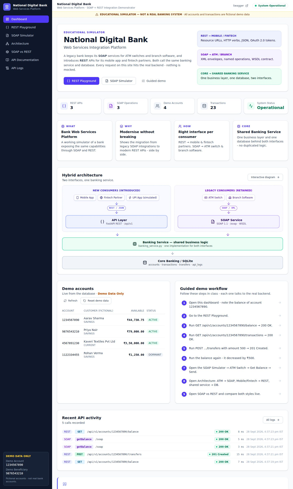
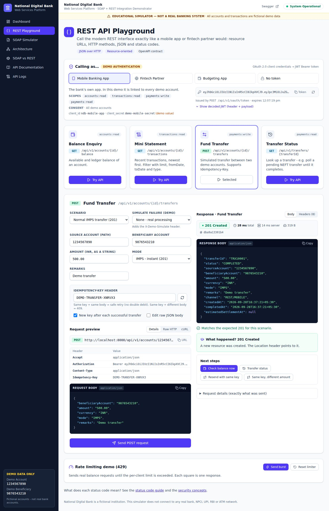
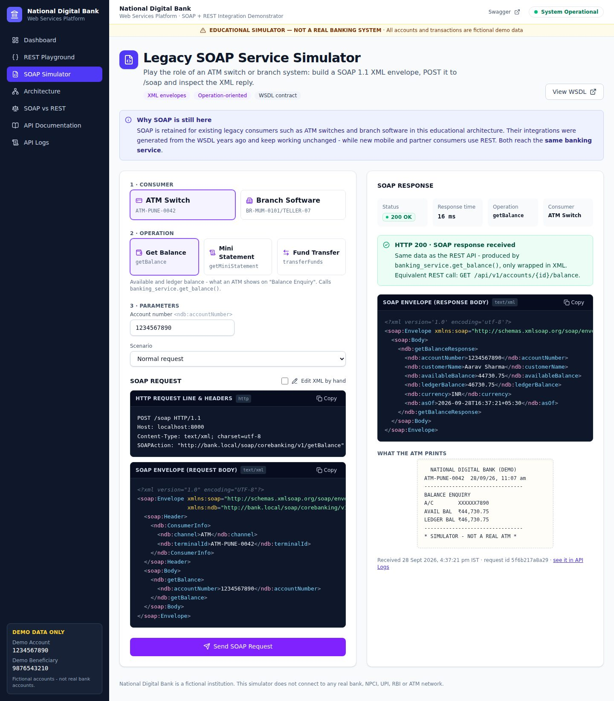
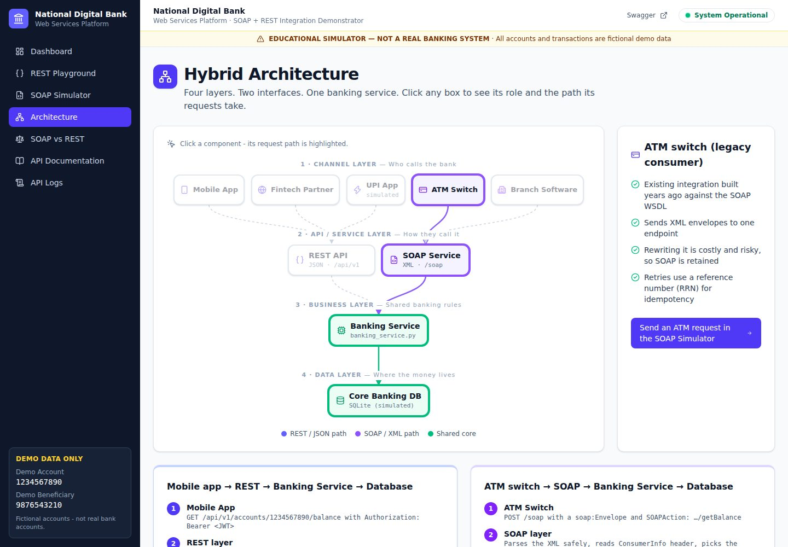
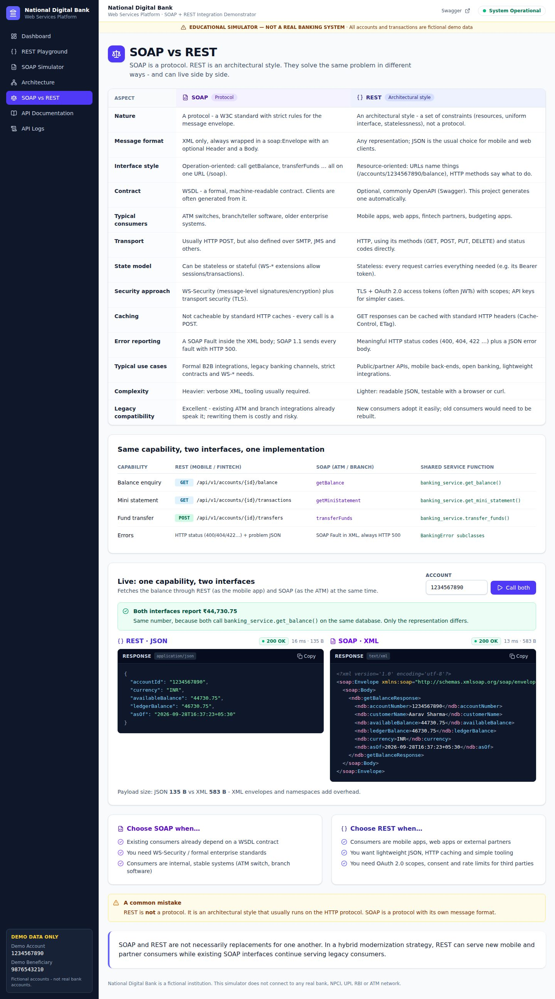
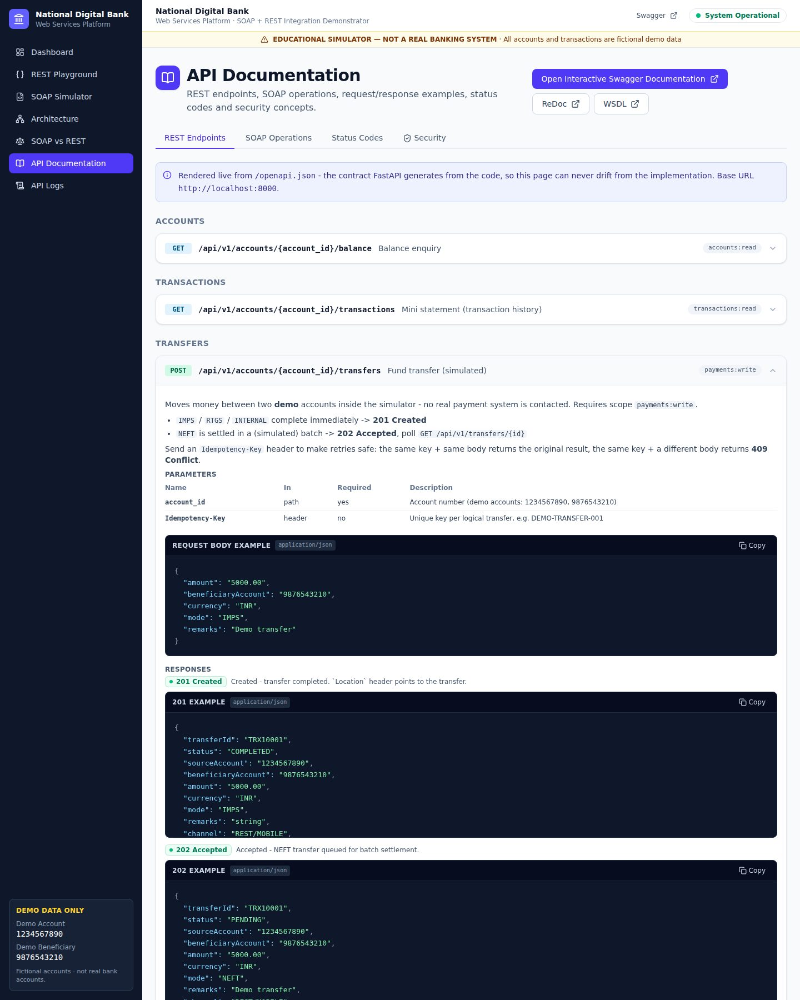
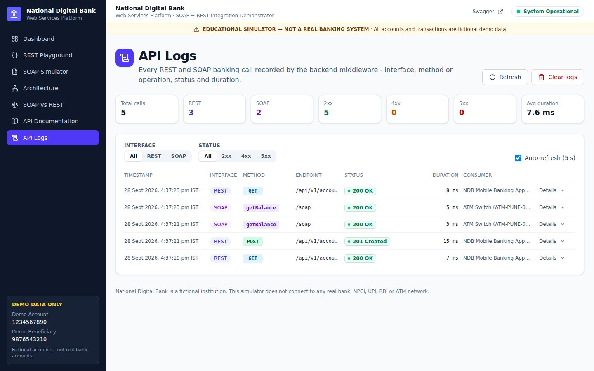
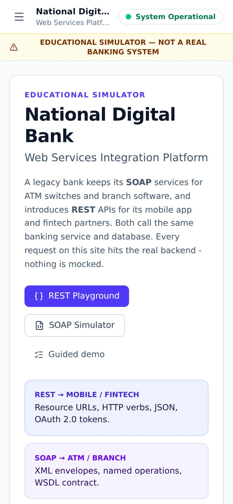

# Bank Web Services Platform

### SOAP + REST Integration Demonstrator — *National Digital Bank*

> ⚠️ **EDUCATIONAL SIMULATOR — NOT A REAL BANKING SYSTEM.** National Digital Bank is a fictional institution. This
> project does not connect to SBI, Bank of Baroda, Union Bank, NPCI, RBI, real UPI, ATM networks, customer accounts or
> any payment system. Every account, transaction and transfer is **demo data** stored in a local SQLite file.

A full-stack academic project that shows — with **real, working requests** — how a bank can keep its legacy **SOAP**
services for ATM switches and branch software while introducing **REST** APIs for mobile apps and fintech partners,
with **one shared banking service** underneath both.



---

## Contents

1. [Problem statement](#1-problem-statement) · 2. [Objectives](#2-objectives) · 3. [Architecture](#3-architecture) ·
4. [Technology stack](#4-technology-stack) · 5. [Features](#5-features) · 6. [REST endpoints](#6-rest-endpoints) ·
7. [SOAP operations](#7-soap-operations) · 8. [Database](#8-database) · 9. [Installation](#9-installation) ·
10. [Running](#10-running-the-application) · 11. [Demo workflow](#11-demo-workflow-for-class) · 12. [Testing](#12-testing) ·
13. [API documentation](#13-api-documentation) · 14. [Screenshots](#14-screenshots) · 15. [Project structure](#15-project-structure) ·
16. [Future scope](#16-future-scope) · 17. [Limitations](#17-limitations) · 18. [Disclaimer](#18-educational-disclaimer)

## 1. Problem statement

A legacy Indian nationalized bank exposes its core banking operations — **balance enquiry**, **fund transfer** and
**mini statement** — as SOAP web services consumed by its **ATM switch** and **branch software**. The bank now wants a
**mobile banking app**, **REST APIs for fintech partners** and **budgeting apps**, and modern **JSON** integrations.

Rewriting the ATM and branch integrations would be costly and risky, yet the new consumers expect lightweight REST.
**Decision:** retain SOAP for the legacy consumers, introduce REST for the new ones, and implement the banking logic
once in a shared service layer.

## 2. Objectives

* Visualise the SOAP vs REST hybrid architecture.
* Test REST APIs in a graphical **API playground** and legacy operations in a **SOAP simulator**.
* Perform simulated **balance enquiry**, **mini statement** and **fund transfer** — with real database updates.
* Show **HTTP status codes**, **JSON** and **XML** request/response payloads, headers and timings.
* Record and display **API logs** for both interfaces.
* Explain *why* SOAP remains for ATM/branch and *why* REST is introduced for mobile/fintech.
* Prove that **the same banking capability** can be exposed through different interfaces.

## 3. Architecture

```
  Mobile App · Fintech Partner · UPI App (simulated)        ATM Switch · Branch Software
                        │                                              │
                   REST / JSON                                    SOAP / XML
                        ▼                                              ▼
          ┌──────────────────────────┐                 ┌──────────────────────────┐
          │  FastAPI REST  /api/v1   │                 │  SOAP 1.1 Service  /soap │
          │  OAuth2 · JWT · 429 ·    │                 │  WSDL · XML · Faults     │
          │  idempotency · problem   │                 │                          │
          └────────────┬─────────────┘                 └─────────────┬────────────┘
                       └──────────────────┬──────────────────────────┘
                                          ▼
                        ┌──────────────────────────────────┐
                        │  Banking Service (shared logic)  │
                        │  app/services/banking_service.py │
                        └────────────────┬─────────────────┘
                                         ▼
                        ┌──────────────────────────────────┐
                        │  SQLite — core banking simulator │
                        └──────────────────────────────────┘
```

The REST routers and the SOAP endpoint contain **no banking rules** — both call `get_balance()`,
`get_mini_statement()` and `transfer_funds()` in `banking_service.py`. A unit test spies on the service to prove both
interfaces call the same function. Details, sequence diagrams and the data model: [`docs/architecture.md`](docs/architecture.md).

## 4. Technology stack

| Layer | Technology |
|---|---|
| Frontend | React 19, Vite, JavaScript, Tailwind CSS v4, React Router 7, Axios, Lucide icons |
| Backend | Python 3.10+, FastAPI, Uvicorn, Pydantic v2 |
| SOAP | SOAP 1.1 implemented with **lxml** + hand-written WSDL 1.1 (see [why not Spyne](docs/architecture.md#8-why-lxml-instead-of-spyne-for-soap)) |
| Database | SQLite via SQLAlchemy 2 ORM |
| API docs | OpenAPI → Swagger UI (`/api-docs`) and ReDoc (`/redoc`); WSDL (`/soap?wsdl`) |
| Testing | pytest, FastAPI TestClient, **zeep** (independent SOAP client) · Playwright for the browser walkthrough |

No Docker, Kubernetes, Redis, Kafka, MongoDB, microservices or cloud services — deliberately simple.

## 5. Features

**Banking (simulated)**
* Balance enquiry (available vs ledger balance), mini statement with `limit` / `fromDate` / `toDate` / `type` filters
* Fund transfers: IMPS (201), NEFT batch settlement (202 → poll status), RTGS (min ₹2,00,000), INTERNAL
* Atomic transfers in one DB transaction; **Decimal** money stored as exact integer paise
* Idempotency (`Idempotency-Key` for REST, `referenceId`/RRN for SOAP)

**REST interface**
* Resource-oriented endpoints, JSON, camelCase, money as strings
* **DEMO AUTHENTICATION**: OAuth 2.0 client-credentials token endpoint, HS256 JWT, scopes, consent
* In-memory rate limiting (429 + `Retry-After`), RFC 9457 problem-details errors, request IDs
* Error simulation header (`X-Demo-Simulate: 500 | 503 | 504`) — nothing actually breaks

**SOAP interface**
* `getBalance`, `getMiniStatement`, `transferFunds`; SOAP Faults with typed detail; WSDL
* Hardened XML parsing (no DTD / external entities → XXE-safe); ATM/Branch consumer header

**UI (7 pages)**
* **Dashboard** — what/why/how/core, live statistics, hybrid architecture, demo accounts, guided demo steps
* **REST Playground** — endpoint cards, *Try API* panel, scenarios (404/401/403/400/422/409/202…), request preview,
  raw HTTP & cURL, status/timing/headers/JSON, balance-change detection, idempotency replay buttons, rate-limit burst
* **SOAP Simulator** — ATM Switch / Branch Software, three operations, formatted XML request & response, fault
  scenarios, editable XML, “what the ATM prints” receipt
* **Architecture** — interactive 4-layer diagram with highlighted request paths and REST/SOAP explanations
* **SOAP vs REST** — comparison table, capability mapping, **live side-by-side call** of both interfaces
* **API Documentation** — rendered live from `/openapi.json`, SOAP operations + live WSDL, status-code guide, security concepts
* **API Logs** — REST/SOAP and 2xx/4xx/5xx filters, statistics, request/response details, auto-refresh, clear (204)

## 6. REST endpoints

| Method | Path | Scope | Success |
|---|---|---|---|
| `POST` | `/api/v1/oauth/token` | – (DEMO client credentials) | 200 |
| `GET` | `/api/v1/accounts/{account_id}/balance` | `accounts:read` | 200 |
| `GET` | `/api/v1/accounts/{account_id}/transactions` | `transactions:read` | 200 |
| `POST` | `/api/v1/accounts/{account_id}/transfers` | `payments:write` | 201 / 202 |
| `GET` | `/api/v1/transfers/{transfer_id}` | `payments:read` | 200 |
| `GET` | `/api/v1/health`, `/health` | – | 200 |

Full reference with examples and every error code: [`docs/api.md`](docs/api.md).

## 7. SOAP operations

Endpoint `POST /soap` · WSDL `GET /soap?wsdl` · namespace `http://bank.local/soap/corebanking/v1`

| Operation | Purpose | Shared service call | REST equivalent |
|---|---|---|---|
| `getBalance` | balance enquiry | `get_balance()` | `GET …/balance` |
| `getMiniStatement` | recent transactions | `get_mini_statement()` | `GET …/transactions` |
| `transferFunds` | simulated transfer | `transfer_funds()` | `POST …/transfers` |

XML examples, faults and a Python client: [`docs/soap.md`](docs/soap.md).

## 8. Database

SQLite file `backend/bank.db` (created automatically). Tables: `accounts`, `transactions`, `transfers`,
`idempotency_keys`, `api_logs`. Money columns store **integer paise** (`45230.75` → `4523075`) through a custom
`Money` column type, so no floating-point rounding can occur.

| Demo account (fictional) | Customer (fictional) | Type | Available | Notes |
|---|---|---|---|---|
| **1234567890** | Aarav Sharma | Savings | ₹45,230.75 | ledger ₹47,230.75 (₹2,000 uncleared cheque) |
| **9876543210** | Priya Nair | Savings | ₹78,500.00 | demo beneficiary |
| 4567891230 | Kaveri Textiles Pvt Ltd | Current | ₹3,50,000.00 | large enough for RTGS |
| 1122334455 | Rohan Verma | Savings | ₹1,250.00 | **DORMANT** → 409 demos |

21 seeded transactions (12 for the demo account). `python seed.py` is safe to run repeatedly;
`python seed.py --reset` restores the original data (also available as *Reset demo data* on the dashboard).

## 9. Installation

**Prerequisites:** Python **3.10+** (tested on 3.10, 3.11, 3.12, 3.13, 3.14) and Node.js **20.19+** (or 22.12+).

> Run every command **from inside the project folder** (`bank-web-services\backend` or `bank-web-services\frontend`),
> one line at a time. Running them from your home folder picks up the wrong files.

### Backend setup

```bash
cd backend
python -m venv venv
```

Activate the virtual environment:

```bash
# Windows (Command Prompt / PowerShell)
venv\Scripts\activate

# macOS / Linux
source venv/bin/activate
```

Then:

```bash
pip install -r requirements.txt
python seed.py
uvicorn app.main:app --reload --port 8000
```

**Windows tip:** if activation is blocked or pip says *"Defaulting to user installation"*, skip activation and call
the virtual environment's Python directly (this is what `start_backend.bat` does):

```powershell
.\venv\Scripts\python.exe -m pip install -r requirements.txt
.\venv\Scripts\python.exe seed.py
.\venv\Scripts\python.exe -m uvicorn app.main:app --reload --port 8000
```

Optional: `copy .env.example .env` (Windows) or `cp .env.example .env` to change settings (rate limit, NEFT delay,
CORS origins …). The defaults work without a `.env` file.

### Frontend setup

In a **second** terminal:

```bash
cd frontend
npm install
npm run dev
```

Optional: copy `frontend/.env.example` to `frontend/.env` if the backend is not on `http://localhost:8000`.

## 10. Running the application

| What | URL |
|---|---|
| **Simulator UI** | http://localhost:5173 |
| Backend root | http://localhost:8000 |
| Swagger UI | http://localhost:8000/api-docs |
| ReDoc | http://localhost:8000/redoc |
| SOAP endpoint / WSDL | http://localhost:8000/soap · http://localhost:8000/soap?wsdl |
| Health | http://localhost:8000/health |

**One-command start (Windows):** double-click **`start_all.bat`**. It checks that Python and Node.js are installed,
opens the backend and the frontend in two windows (creating the venv, installing dependencies and seeding on the
first run), **waits until both servers answer**, and then opens the browser. The first run needs internet access and
can take a few minutes; later starts take seconds. Keep the two server windows open while you use the simulator.
Or run `start_backend.bat` and `start_frontend.bat` separately. On macOS/Linux: `./start_backend.sh` and
`./start_frontend.sh` in two terminals.

### Troubleshooting

| Symptom | Cause and fix |
|---|---|
| Browser: *"localhost refused to connect"* / `ERR_CONNECTION_REFUSED` on `localhost:5173` | The frontend server is not running **on your computer**. Start it (`start_all.bat`, or `npm run dev` in `frontend/`) and keep its window open. On the first run wait until the window shows `Local: http://localhost:5173/`. |
| The UI loads but the header says **Backend Offline** | The backend is not running. Start `start_backend.bat` (or `uvicorn app.main:app --reload --port 8000` in `backend/`) and keep its window open. |
| `'python' is not recognized` | Install Python 3.10+ from python.org and tick **"Add python.exe to PATH"**. |
| `'npm' is not recognized` or a Vite *"Node.js version"* error | Install the Node.js **LTS** version (20.19+ or 22.12+) from nodejs.org, then open a new terminal. |
| `Port 5173 is already in use` / `address already in use` (8000) | Another copy is already running — close the old windows, or stop the other program using that port. |
| `bank-web-services` folder is missing | You downloaded the default branch. Get the branch that contains this project (see below). |

**Getting the code:** this project is on the branch `claude/gracious-darwin-infyvg`:

```bash
git clone -b claude/gracious-darwin-infyvg https://github.com/soham0777/Weather-forecast.git
cd Weather-forecast/bank-web-services
```

or download the ZIP from
`https://github.com/soham0777/Weather-forecast/archive/refs/heads/claude/gracious-darwin-infyvg.zip`
(once the branch is merged into `main`, the normal *Code → Download ZIP* works too).

**Demo data:** Demo Account `1234567890` · Demo Beneficiary `9876543210` — *Demo Data Only.*

## 11. Demo workflow (for class)

1. Open the **Dashboard** — note the balance of 1234567890 (₹45,230.75).
2. Go to **REST Playground**.
3. *Balance Enquiry* → **Try API** → Send → `GET /api/v1/accounts/1234567890/balance` → **200 OK**.
4. *Mini Statement* → Send → **200 OK**.
5. *Fund Transfer* → amount **500** → Send → **201 Created** (`TRX10001`).
6. *Check balance now* → balance is **₹44,730.75**; the UI highlights *“Balance changed by −₹500.00”*.
7. Open **SOAP Simulator** → **ATM Switch** → **Get Balance** → *Send SOAP Request* → XML request and XML response
   (same balance, straight from the same service).
8. Open **Architecture** → click ATM Switch (→ SOAP) and Mobile App (→ REST); both paths meet at the shared
   Banking Service → database.
9. Open **SOAP vs REST** → read the table → *Call both* to fetch the same balance as JSON and as XML side by side.

Extras: scenarios for 400/401/403/404/409/422, NEFT 202 + polling, *Resend with same key* (idempotent replay),
*Same key, different amount* (409), rate-limit burst (429), simulated 500/503/504, and the API Logs page.

## 12. Testing

```bash
cd backend
# (venv activated)
pytest
```

58 tests cover: balance success / unknown account / malformed id, transaction retrieval and filters, transfer
success (balances, ledger entries, Location header), insufficient balance, invalid amounts, unknown beneficiary,
dormant account, RTGS limit, NEFT 202 + settlement, exact Decimal arithmetic, idempotent replay and 409 conflict,
auth (401 / 403 scope / 403 consent / tampered token), rate limiting (429 + Retry-After), simulated 500/503/504
without leaking internals, API logging, 204 No Content, CORS, SOAP getBalance / getMiniStatement / transferFunds,
SOAP faults, malformed XML, SOAP 1.2 version mismatch, XXE protection, WSDL, **REST and SOAP calling the same service
function**, and a live-server interoperability test with the **zeep** SOAP client.

```
58 passed in 5.4s   (Python 3.10, 3.11, 3.12, 3.13 and 3.14)
```

Frontend quality checks: `npm run lint` and `npm run build`. The full class demo workflow was also verified in a
headless Chromium browser (50 checks, including no horizontal scrolling at phone and tablet widths and no JavaScript
console errors).

## 13. API documentation

* **Swagger UI** — http://localhost:8000/api-docs. Click **Authorize**: the DEMO credentials
  (`ndb-mobile-app` / `demo-mobile-secret`) are pre-filled; tick the scopes, authorize, then *Try it out*.
* **ReDoc** — http://localhost:8000/redoc
* **WSDL** — http://localhost:8000/soap?wsdl
* **In the UI** — the *API Documentation* page renders the live OpenAPI contract, SOAP operations, the status-code
  guide and security concepts.
* Markdown: [`docs/architecture.md`](docs/architecture.md) · [`docs/api.md`](docs/api.md) · [`docs/soap.md`](docs/soap.md)

## 14. Screenshots

| | |
|---|---|
| **REST Playground** — transfer 201 Created  | **SOAP Simulator** — ATM getBalance  |
| **Architecture** — ATM → SOAP → Banking Service → DB  | **SOAP vs REST** — live side-by-side  |
| **API Documentation** — live OpenAPI  | **API Logs**  |

<p align="center"></p>

## 15. Project structure

```
bank-web-services/
├── backend/
│   ├── app/
│   │   ├── main.py                 # FastAPI app, middleware, routers, Swagger/ReDoc URLs
│   │   ├── config.py               # settings (.env)
│   │   ├── database.py             # engine, sessions, Money column type
│   │   ├── models.py               # ORM tables
│   │   ├── schemas.py              # JSON contract (Pydantic)
│   │   ├── seed_data.py            # fictional demo data
│   │   ├── api/                    # REST: accounts, transactions, transfers, health, auth, logs, demo, deps, errors
│   │   ├── services/banking_service.py   # ★ shared business logic (REST + SOAP)
│   │   ├── soap/                   # SOAP 1.1 endpoint + WSDL
│   │   └── utils/                  # logging middleware, DEMO JWT security, rate limiter
│   ├── tests/                      # pytest suite (58 tests)
│   ├── seed.py · requirements.txt · pytest.ini · .env.example · README.md
├── frontend/
│   ├── src/
│   │   ├── components/             # RequestViewer, ResponseViewer, JsonViewer, XmlViewer, StatusBadge, ApiMethodBadge, …
│   │   ├── pages/                  # Dashboard, RestPlayground, SoapSimulator, Architecture, Comparison, ApiDocs, ApiLogs
│   │   ├── services/               # Axios API client, DEMO auth, SOAP envelope builder, formatting
│   │   ├── data/                   # educational content (status codes, comparison, architecture, demo clients)
│   │   ├── hooks/ · App.jsx · main.jsx · index.css
│   ├── package.json · vite.config.js · .env.example
├── docs/  architecture.md · api.md · soap.md · screenshots/
├── start_all.bat · start_backend.bat · start_frontend.bat · start_backend.sh · start_frontend.sh
├── README.md · .gitignore
```

## 16. Future scope

* Authorization Code + PKCE flow with a simulated customer login and a clearly labelled **DEMO OTP** step
* An API-gateway facade (REST → SOAP) to show the *wrapper* migration pattern as an alternative
* WS-Security `UsernameToken` / signed messages on the SOAP side
* Webhooks for NEFT settlement instead of polling; `ETag`/`Cache-Control` demonstrations on GET
* PostgreSQL with row-level locking; Docker Compose for one-command deployment
* Beneficiary management, standing instructions, account statements as PDF

## 17. Limitations

* **Not real banking** — no real accounts, money, payment rails or security guarantees.
* DEMO AUTHENTICATION uses public demo client secrets and a demo signing key; there is no customer login or OTP.
* The rate limiter and the transfer lock are in-memory and per process (run a single Uvicorn worker).
* SQLite allows one writer at a time — fine for a classroom, not for production load.
* NEFT settlement is simulated lazily (when data is next read), not by a real batch scheduler.
* Swagger UI and ReDoc load their JavaScript from a CDN, so those two pages need internet access
  (the simulator UI itself works offline).

## 18. Educational disclaimer

This software is an **educational simulator**. *National Digital Bank* is fictional; all names, account numbers and
transactions are invented demo data. It does not connect to, represent or imitate any real bank, NPCI, UPI, RBI,
ATM network or payment system, and it must not be used for real financial transactions or to store real credentials.
