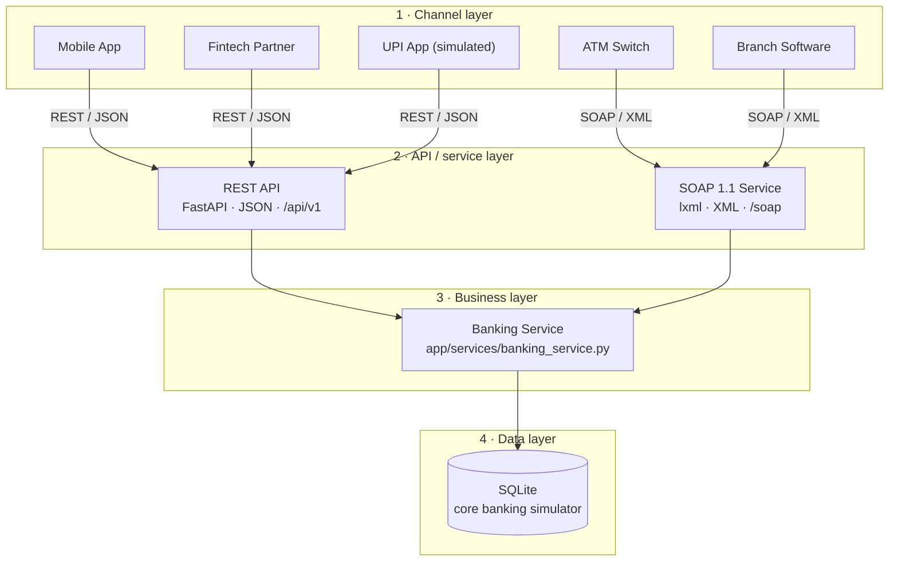
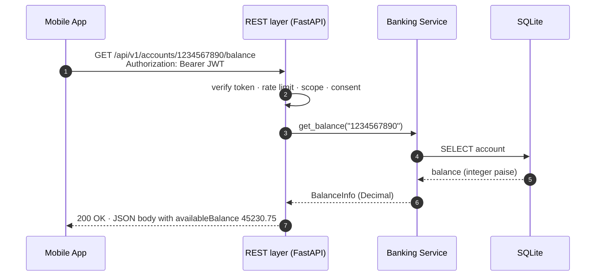
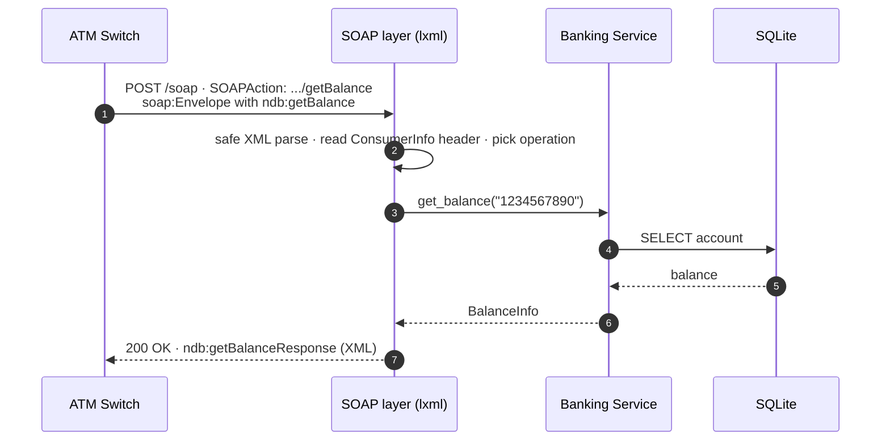
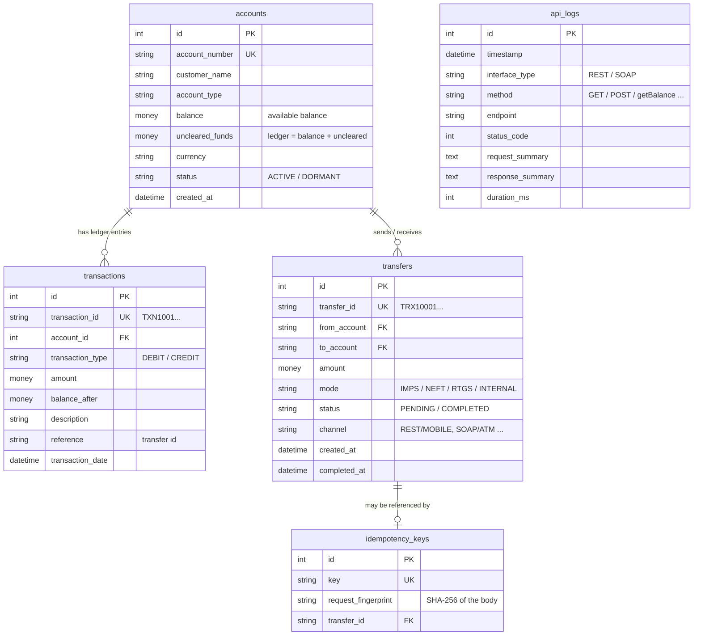

# Architecture

> **EDUCATIONAL SIMULATOR — NOT A REAL BANKING SYSTEM.** National Digital Bank is fictional. Nothing here connects
> to a real bank, NPCI, UPI, RBI, an ATM network or any payment system.

## 1. The case study

A legacy Indian nationalized bank exposes core banking operations — **balance enquiry**, **fund transfer** and
**mini statement** — as **SOAP** services consumed by its **ATM switch** and **branch software**. It now needs a
mobile banking app, APIs for fintech partners and budgeting apps, and modern JSON integrations.

**Architectural decision**

| Decision | Reason |
|---|---|
| **Retain SOAP** for the ATM switch and branch software | Those integrations already work against the WSDL; re-building and re-certifying them is expensive and risky. |
| **Introduce REST** for mobile apps and fintech partners | New consumers expect lightweight JSON over HTTP, OAuth 2.0 scopes, rate limits and OpenAPI docs. |
| **Share one banking service** underneath both | Business rules exist exactly once, so both channels always behave identically. |

> SOAP and REST are not necessarily replacements for one another. In a hybrid modernization strategy, REST can
> serve new mobile and partner consumers while existing SOAP interfaces continue serving legacy consumers.

## 2. Logical architecture



The React UI plays every consumer: the **REST Playground** acts as the mobile app / partners, the **SOAP
Simulator** acts as the ATM switch / branch software.

### The one rule that matters

```
Wrong:  REST -> REST banking logic        Correct:  REST --+
        SOAP -> SOAP banking logic                         +--> Banking Service --> Database
                                                  SOAP --+
```

`app/api/*.py` (REST) and `app/soap/service.py` (SOAP) contain **no banking rules**. They only translate between
their wire format and the plain Python functions of `banking_service.py`:

| Capability | REST | SOAP | Shared function |
|---|---|---|---|
| Balance enquiry | `GET /api/v1/accounts/{id}/balance` | `getBalance` | `get_balance()` |
| Mini statement | `GET /api/v1/accounts/{id}/transactions` | `getMiniStatement` | `get_mini_statement()` |
| Fund transfer | `POST /api/v1/accounts/{id}/transfers` | `transferFunds` | `transfer_funds()` |
| Transfer status | `GET /api/v1/transfers/{id}` | – | `get_transfer()` |

A test (`test_rest_and_soap_call_the_same_service_function`) spies on `banking_service.get_balance` and proves both
interfaces call the very same function.

## 3. Request journeys





Errors travel the same way: the service raises a `BankingError` (e.g. `InsufficientFundsError`, code
`INSUFFICIENT_FUNDS`). REST turns it into **HTTP 422 + problem JSON**; SOAP turns it into a **SOAP Fault** (HTTP 500,
`faultcode soap:Client`, `errorCode INSUFFICIENT_FUNDS`).

## 4. Backend modules

| Module | Responsibility |
|---|---|
| `app/main.py` | Creates the FastAPI app, middleware (CORS, logging), routers; Swagger at `/api-docs`, ReDoc at `/redoc` |
| `app/config.py` | Settings from environment / `.env` |
| `app/database.py` | Engine, sessions, and the `Money` column type (exact integer paise ↔ `Decimal`) |
| `app/models.py` | ORM tables: `accounts`, `transactions`, `transfers`, `idempotency_keys`, `api_logs` |
| `app/schemas.py` | Pydantic models = the JSON contract (camelCase, money as strings) |
| `app/services/banking_service.py` | **All banking rules**: validation, balances, transfers, NEFT settlement, idempotency |
| `app/api/deps.py` | Request pipeline: error simulation → authentication → rate limiting → scope check |
| `app/api/errors.py` | RFC 9457 problem-details errors; maps `BankingError` codes to HTTP status codes |
| `app/api/*.py` | REST routers (accounts, transactions, transfers, health, auth, logs, demo) |
| `app/soap/service.py` | SOAP 1.1 endpoint: parse envelope, dispatch operation, build response or Fault |
| `app/soap/wsdl.py` | The WSDL 1.1 contract served at `/soap?wsdl` |
| `app/utils/security.py` | DEMO OAuth 2.0 clients and HS256 JWT signing/verification (standard library only) |
| `app/utils/rate_limiter.py` | In-memory sliding-window rate limiter |
| `app/utils/logger.py` | ASGI middleware: request IDs, timing, console log, `api_logs` table, safe 500s |
| `app/seed_data.py`, `seed.py` | Fictional demo data; `python seed.py [--reset]` |

## 5. Data model



**Money is never a float.** Python uses `Decimal`; the database stores integer **paise** (`45230.75` →
`4523075`); JSON carries amounts as strings (`"45230.75"`); the UI formats them with BigInt arithmetic. SQLite's
`NUMERIC` affinity would silently convert `"45230.75"` into a floating-point `REAL`, which is why the custom
`Money` column type exists.

## 6. Fund transfer - one atomic database transaction

`transfer_funds()` performs every step inside one transaction; if any step fails, `rollback()` undoes all of them.

1. Idempotency check (same key + same body → return the original transfer; same key + different body → conflict)
2. Validate the source account (exists, `ACTIVE`)
3. Validate the beneficiary (exists, `ACTIVE`, not the same account)
4. Validate amount, currency, mode and limits (`> 0`, max 2 decimals, RTGS ≥ ₹2,00,000, ≤ ₹1 crore)
5. Check the available balance
6. Debit the source and write its `DEBIT` ledger entry
7. Credit the beneficiary and write its `CREDIT` entry (NEFT: later, at simulated batch settlement)
8. Create the transfer record and the idempotency record
9. `COMMIT`

SQLite allows one writer at a time, so balance-changing work is also serialised with a process-wide lock; a
production core-banking system would use row-level locks (`SELECT … FOR UPDATE`) instead.

**NEFT** is batch-settled in real life. The simulator debits the sender immediately, returns **202 Accepted** with
status `PENDING`, and credits the beneficiary once `NEFT_SETTLEMENT_SECONDS` (default 20 s) have passed — settlement
happens lazily the next time any data is read, so no background scheduler is needed.

## 7. Cross-cutting concerns (REST)

| Concern | Implementation | Visible as |
|---|---|---|
| Authentication | DEMO OAuth 2.0 client credentials, HS256 JWT | `401` + `WWW-Authenticate` |
| Authorization | Scopes `accounts:read`, `transactions:read`, `payments:write`, `payments:read` | `403 INSUFFICIENT_SCOPE` |
| Consent | `consent.accounts` claim for third-party clients | `403 CONSENT_REQUIRED` |
| Rate limiting | Sliding window, 30 req / 60 s per client | `429` + `Retry-After`, `X-RateLimit-*` |
| Idempotency | `Idempotency-Key` header, fingerprinted body | `Idempotent-Replayed: true`, `409` |
| Errors | RFC 9457 problem details, no stack traces | `application/problem+json` |
| Tracing | Request ID per call | `X-Request-ID`, `requestId` in errors and logs |
| Logging | ASGI middleware → console + `api_logs` | API Logs page |
| CORS | Explicit origins only (`FRONTEND_URL`) | – |

## 8. Why lxml instead of Spyne for SOAP?

Spyne's latest release (2.14.0) fails to import on Python 3.12 and 3.13
(`ModuleNotFoundError: No module named 'spyne.util.six.moves'` — verified while building this project), and
students on Windows usually install a recent Python. The SOAP endpoint is therefore implemented directly with
**lxml**: about 275 readable lines (plus the WSDL), it shows every step of SOAP processing (envelope parsing, operation dispatch,
Faults, WSDL), runs on Python 3.10–3.13, and is verified for interoperability with **zeep**, an independent SOAP
client library that generates its client from our WSDL (`tests/test_soap.py::test_zeep_soap_client_interoperability`).
