# College Internship Management System (CIMS)
## Project Report

> Diagrams in this document are written in Mermaid; GitHub renders them automatically. To put
> them in a Word/PDF report, paste each block into <https://mermaid.live> and export as PNG/SVG.

---

## 1. Abstract

Internship placement is a core responsibility of a college's Training & Placement cell, yet it is
commonly handled through spreadsheets, notice boards and e-mail. This makes it difficult to see
which internships are available, who has applied, what stage each application has reached and
how useful an internship was. The **College Internship Management System (CIMS)** is a web
application that centralises the complete internship lifecycle — student registration, profiles
and resumes, internship posting and approval, applications, shortlisting, interviews, results,
evaluations, completion, feedback and reports — in a single system with separate portals for
administrators, faculty coordinators and students. It is built with a React frontend, a Spring
Boot REST API secured with JWT and role-based authorisation, and a normalised MySQL database
that enforces data integrity with keys and constraints. All dashboards and reports are computed
from live data.

## 2. Introduction

An internship programme involves several parties: students looking for opportunities, faculty
members who coordinate internships with companies, companies that host interns, and the
placement office that oversees the process. Each step produces information — postings,
resumes, decisions, interview slots, ratings — that must be recorded accurately and shared with
the right people at the right time.

CIMS models this process explicitly. Every internship, application and interview has a
controlled status, every status change is recorded with who made it and when, and every user
only sees and changes what their role permits.

## 3. Problem Statement

The manual process has the following problems:

1. **No single source of truth** — postings, applications and results are scattered across files and mailboxes.
2. **Poor tracking** — students cannot see the status of their applications; staff cannot see pending work.
3. **Weak validation** — duplicate applications, missing resumes, invalid dates and inconsistent statuses are common.
4. **No approval control** — internships can be circulated without review by the placement office.
5. **No feedback loop** — the quality of internships and interns is not measured systematically.
6. **Slow reporting** — placement statistics must be compiled by hand and are often out of date.
7. **Privacy and security risks** — resumes and personal data are shared without access control.

## 4. Existing System

| Aspect | Existing (manual) process |
|--------|---------------------------|
| Postings | Notices, WhatsApp/e-mail forwards, spreadsheets |
| Applications | Google Forms or e-mailed resumes; duplicates and missing documents common |
| Status tracking | Asked in person or by e-mail |
| Interviews | Scheduled by phone/e-mail; no central calendar |
| Evaluation | Paper forms, not linked to the application |
| Reports | Compiled manually at the end of the semester |
| Security | No authentication; files shared freely |

## 5. Proposed System

CIMS is a role-based web application:

- **Administrators** manage users and companies, approve internships, monitor activity and view reports.
- **Faculty coordinators** post internships, review applications, schedule interviews and evaluate interns.
- **Students** maintain a profile and resume, apply for internships and track their progress.

Business rules (password policy, PDF-only resumes, one application per internship, 4-week to
6-month durations, 24-hour interview notice, 1–5 ratings, …) are enforced by the backend and the
database, not only by the user interface.

## 6. Objectives

1. Provide a centralised, secure platform for the complete internship lifecycle.
2. Enforce role-based access for Admin, Faculty and Student.
3. Implement an approval workflow for internship postings.
4. Prevent invalid or duplicate data through validation and database constraints.
5. Give students transparent, real-time tracking of applications and interviews.
6. Capture structured evaluations and feedback from students, companies and faculty.
7. Generate accurate reports and dashboards directly from the database.
8. Be deployable to the internet with managed hosting and a managed MySQL database.

## 7. Scope

**In scope:** authentication and account management; student, faculty and company management;
internships with approval; applications with resume upload; interviews; evaluations; four
feedback categories; admin/faculty/student dashboards and reports; audit logging; responsive UI;
deployment configuration; automated tests and API collection.

**Out of scope (by design):** company login, payments, attendance, video interviews, AI-based
screening or recommendations, chatbots and mobile apps. Companies are managed by administrators,
and company feedback is recorded by faculty on their behalf.

## 8. Functional Requirements

| ID | Requirement |
|----|-------------|
| FR-1 | Students can register with e-mail, password, name, phone, department and GPA |
| FR-2 | All users can log in/out; tokens expire; deactivated accounts cannot log in |
| FR-3 | Passwords must have ≥ 8 characters with upper, lower, digit and special character |
| FR-4 | E-mails are validated, normalised and unique; verification status is tracked |
| FR-5 | Students can view/update their profile and upload/replace/view a PDF resume (≤ 5 MB) |
| FR-6 | Admins can create, view, update and deactivate students and faculty |
| FR-7 | Admins can create, view, update and archive companies; registration numbers are valid and unique |
| FR-8 | Faculty create internships (PENDING); admins approve or reject; approved internships can be opened and closed |
| FR-9 | Internship durations are 4 weeks – 6 months; start before end; deadline before start; future dates |
| FR-10 | Students search internships by title, company, domain and location and filter by domain, company, location and stipend, with pagination |
| FR-11 | Students apply with cover letter, qualifications and mandatory resume; duplicates are rejected |
| FR-12 | Faculty/admin change application status (shortlist, accept, reject); students can withdraw |
| FR-13 | Every status change is stored and displayed as an application timeline |
| FR-14 | Faculty/admin schedule, reschedule, complete (with result) and cancel interviews; ≥ 24 h notice, not in the past, not after the application deadline |
| FR-15 | Faculty/admin evaluate accepted interns on six criteria plus an overall rating (1–5) |
| FR-16 | Students give post-internship feedback; staff record company feedback; faculty give quality feedback; all users submit platform feedback that admins triage |
| FR-17 | Admin, faculty and student dashboards and reports are computed from the database |
| FR-18 | Important actions and rejected requests are recorded in an audit log |

## 9. Non-Functional Requirements

| Category | Requirement and how it is met |
|----------|-------------------------------|
| Security | BCrypt hashing, JWT with server-side user checks, role rules at URL and method level, ownership checks in services, parameterised JPA queries, file validation, CORS allow-list, secrets only in environment variables, no stack traces in responses |
| Integrity | Foreign keys, `UNIQUE` and `CHECK` constraints, controlled enum values, archive/deactivate instead of delete |
| Usability | Consistent design system, inline validation messages, confirmations, empty/loading/error states |
| Accessibility | Labelled inputs, keyboard-operable dialogs and tabs, visible focus, status never shown by colour alone, chart data also available as tables |
| Responsiveness | Works from 360 px phones to desktops; tables scroll horizontally |
| Maintainability | Layered architecture, DTOs, reusable components, automated tests, CI |
| Performance | Server-side pagination (max 100 rows per page), indexes on filter columns, fetch joins to avoid N+1 queries, code-split frontend |
| Portability | Docker image for the API; static build for the UI; environment-based configuration |

## 10. Hardware Requirements

| Use | Recommended minimum |
|-----|---------------------|
| Developer machine | 64-bit dual-core CPU, 8 GB RAM, 5 GB free disk |
| Server (small college deployment) | 1 vCPU, 1 GB RAM for the API container; managed MySQL entry tier; ≥ 1 GB persistent storage for resumes |
| Client | Any device with a modern browser (Chrome, Edge, Firefox, Safari) |

## 11. Software Requirements

| Software | Version |
|----------|---------|
| Operating system | Windows 10/11, macOS or Linux |
| Java Development Kit | 17 or newer |
| Maven | 3.9+ |
| Node.js / npm | Node 20+ (22 recommended) |
| MySQL Server / Workbench | 8.0+ |
| IDE | Visual Studio Code (Java and ESLint extensions) |
| API testing | Postman |
| Version control | Git, GitHub |

## 12. System Architecture

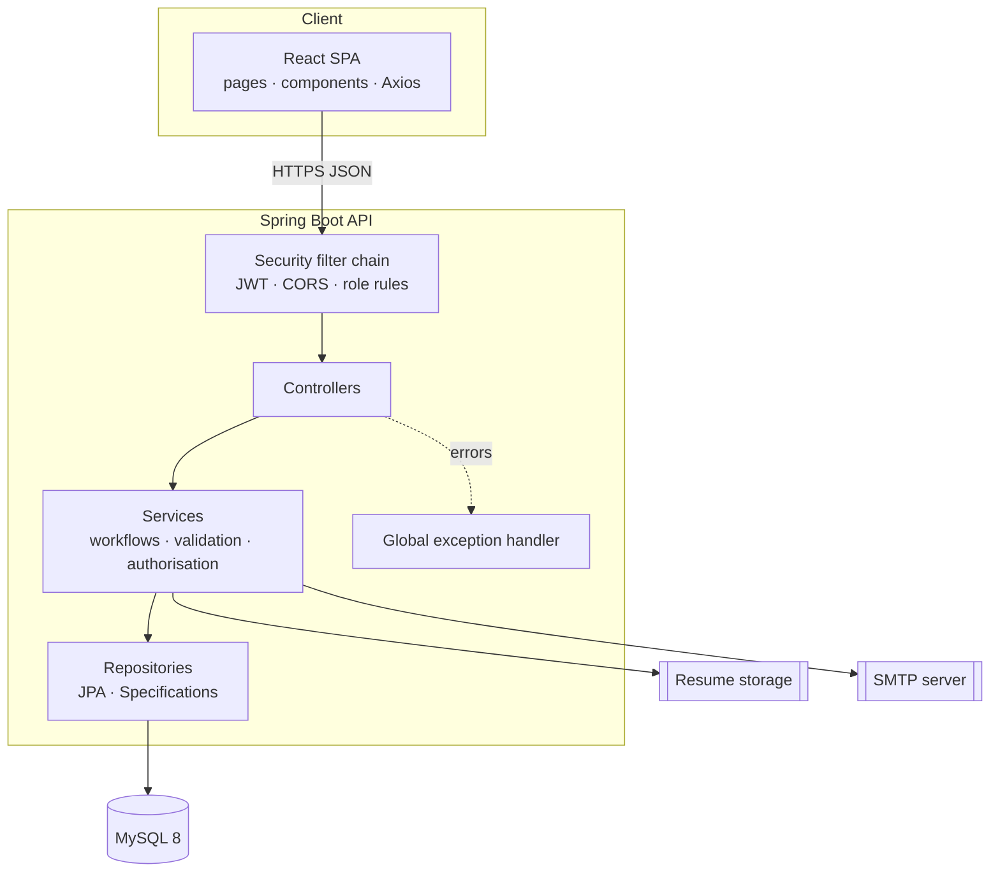

Three tiers: the **presentation tier** (React) renders role-specific portals and calls the REST
API; the **application tier** (Spring Boot) authenticates each request, applies business rules
and authorisation in the service layer, and maps entities to DTOs; the **data tier** (MySQL)
stores all records and enforces integrity constraints.

## 13. ER Diagram

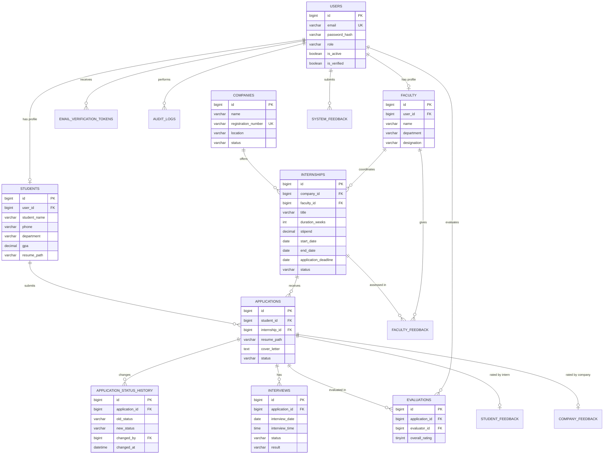

(`STUDENT_FEEDBACK`, `COMPANY_FEEDBACK`, `FACULTY_FEEDBACK`, `SYSTEM_FEEDBACK`, `AUDIT_LOGS` and
`EMAIL_VERIFICATION_TOKENS` attributes are listed in section 14.)

## 14. Database Design

The schema is in third normal form: every table has a surrogate primary key, repeating groups are
split into child tables (status history, interviews, evaluations, feedback), and derived data is
not stored except `duration_weeks`, which the server always recalculates from the dates.

| Table | Important columns | Constraints |
|-------|-------------------|-------------|
| users | email, password_hash, role, is_active, is_verified, last_login_at | UNIQUE(email); CHECK role |
| email_verification_tokens | user_id, token_hash, expires_at, used_at | UNIQUE(token_hash); FK users |
| students | user_id, student_name, phone, department, gpa, resume_path | UNIQUE(user_id); CHECK 0 ≤ gpa ≤ 10 |
| faculty | user_id, name, department, designation, phone | UNIQUE(user_id) |
| companies | name, registration_number, location, contact_*, status | UNIQUE(registration_number); CHECK status |
| internships | company_id, faculty_id, title, description, domain, duration_weeks, stipend, start_date, end_date, application_deadline, status, review_remarks, reviewed_by, created_by | FKs; CHECK status, stipend ≥ 0, 4 ≤ duration ≤ 26, start < end, deadline ≤ start |
| applications | student_id, internship_id, resume_path, cover_letter, qualifications, status, reviewed_at, completed_at, applied_at | UNIQUE(student_id, internship_id); CHECK status; completed ⇒ ACCEPTED |
| application_status_history | application_id, old_status, new_status, changed_by, changed_at, comment | FKs; CHECK statuses |
| interviews | application_id, interview_date, interview_time, interviewer_name, interviewer_details, status, result, comments, scheduled_by | CHECK status/result; completed ⇒ result |
| evaluations | application_id, evaluator_id, 6 criteria, overall_rating, comments, is_archived | ratings 1–5; UNIQUE(application_id, evaluator_id) |
| student_feedback | application_id, company_culture, mentorship_quality, technical_learning, work_environment, overall_experience, comments, suggestions | ratings 1–5; UNIQUE(application_id) |
| company_feedback | application_id, recorded_by, company_representative, 6 criteria, hire_likelihood, strengths, areas_for_improvement, comments | ratings 1–5; UNIQUE(application_id) |
| faculty_feedback | internship_id, faculty_id, course_suitability, learning_outcomes, internship_quality, notes, suggestions | ratings 1–5; UNIQUE(internship_id, faculty_id) |
| system_feedback | submitted_by, feedback_type, title, description, status, admin_response, handled_by | CHECK type/status |
| audit_logs | user_id, action, entity_type, entity_id, details, created_at | indexes on action and time |

Indexes support the common filters (status, domain, deadline, department, role/active).
Timestamps are UTC; user-entered dates/times are in the college time zone.

## 15. Data Flow Diagrams

**Level 0 (context diagram)**

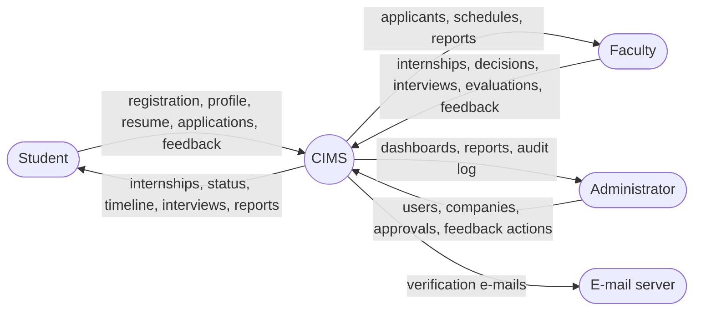

**Level 1**

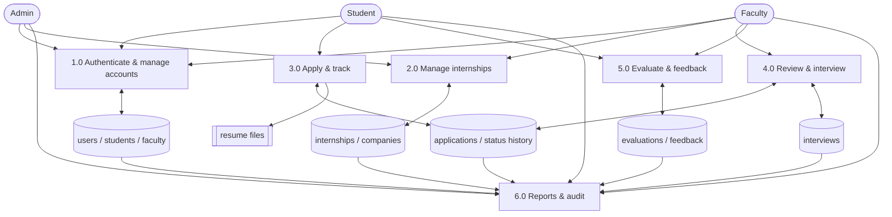

## 16. Use Case Diagram

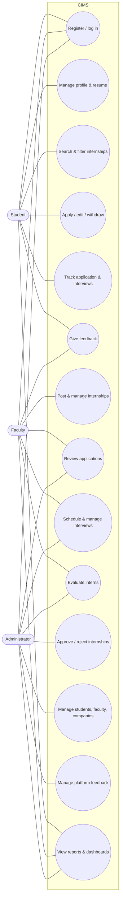

## 17. Class Diagram

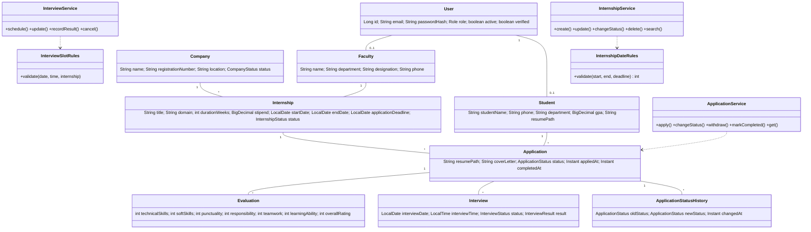

## 18. Sequence Diagrams

**Login**

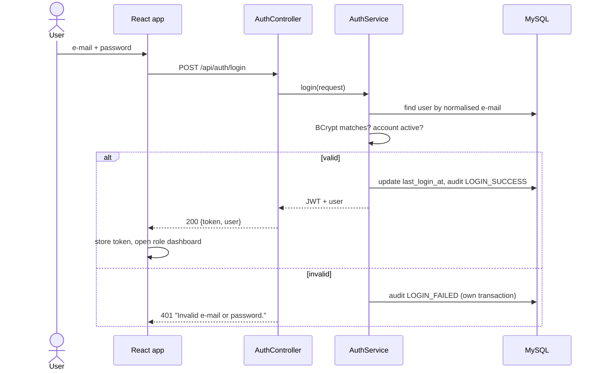

**Apply for an internship**

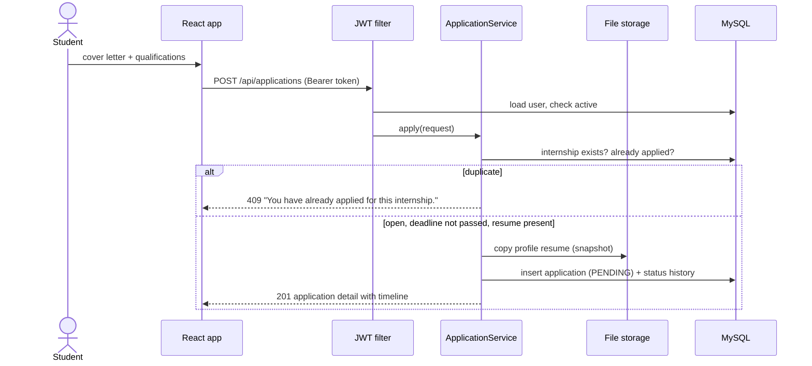

**Schedule an interview**

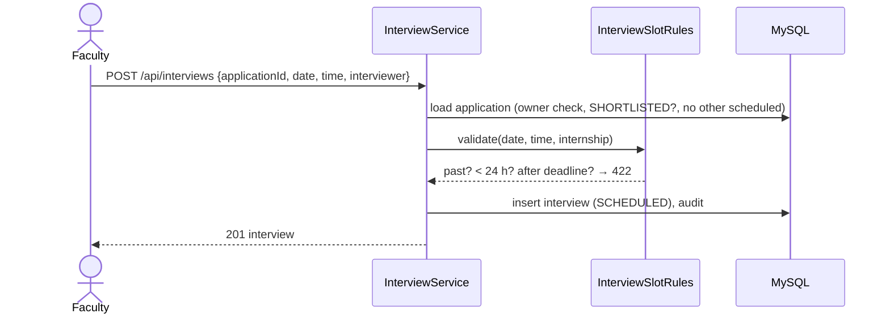

## 19. Activity Diagrams

**Internship approval**

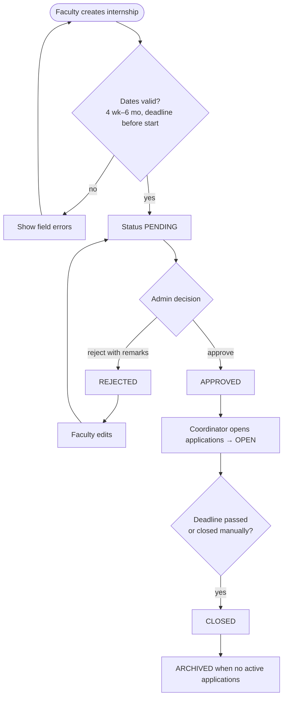

**Application lifecycle**

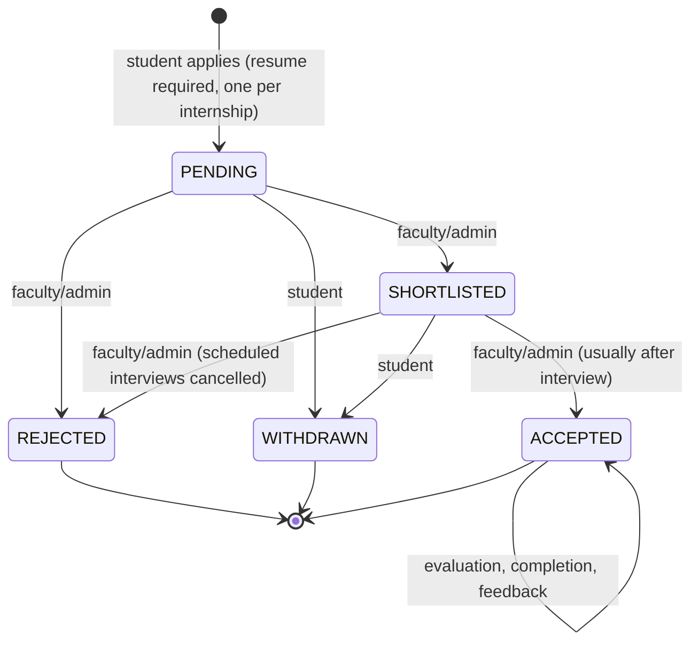

## 20. Implementation

**Backend (Spring Boot 3.5, Java 17).** The API follows a layered design. Controllers validate
input with Bean Validation (custom annotations such as `@StrongPassword`, `@ValidPhone`,
`@ValidRegistrationNumber` and `@Rating`) and delegate to services. Services hold the workflows
(`InternshipService`, `ApplicationService`, `InterviewService`, …), check ownership (a faculty
member can only manage internships they coordinate) and convert entities to DTO records.
Repositories use Spring Data JPA with JPQL and Criteria `Specification`s, so every query is
parameterised. Date-based rules (`InternshipDateRules`, `InterviewSlotRules`) use an injected
`Clock` in the college time zone, which also makes them unit-testable.

**Security.** `JwtAuthenticationFilter` validates the HMAC-signed token and reloads the user on
every request, so deactivation takes effect immediately. URL rules and `@PreAuthorize` enforce
roles; a custom entry point and access-denied handler return JSON 401/403 responses and record
denied attempts. Passwords are hashed with BCrypt; the login path compares against a dummy hash
for unknown e-mails so timing does not reveal which accounts exist. Secrets come only from
environment variables.

**Files.** Resumes are validated (extension, MIME type, `%PDF-` signature, 5 MB) and stored
under random UUID names outside the web root; applications keep their own copy so later profile
changes do not alter submitted documents. Downloads are authorised per request.

**Error handling.** `GlobalExceptionHandler` maps every exception to one JSON format with the
correct status code and friendly messages for constraint violations; stack traces are logged
only on the server.

**Reports.** `ReportQueryRepository` computes aggregates with JPQL (`COUNT`, `AVG`, `CASE`
sums, grouped queries). Rates with a zero denominator return `null` and are shown as
"No data available".

**Frontend (React 19 + Vite + Tailwind CSS 4).** A shared design system (buttons, form fields
with inline errors, badges, cards, tables, pagination, modals, confirmation dialogs, toasts,
skeletons, empty/error states) is reused by all pages. `AuthContext` stores the JWT and handles
expired sessions; `ProtectedRoute` guards routes by role. Pages are lazy-loaded per route.
Charts (Recharts) use a single accessible colour, thin marks, hover tooltips and a table view.

## 21. Testing

Testing is described in detail in [`TESTING.md`](TESTING.md):

- **76 automated tests** (JUnit 5 + MockMvc) run the complete application against an in-memory
  database and cover authentication, validation, file uploads, workflows, business rules,
  access control and security cases. All pass.
- **Schema tests**: `schema.sql` and `seed.sql` are loaded into MySQL 8 in CI; Hibernate schema
  validation confirms that the entities match the tables.
- **API tests**: a Postman collection with status-code assertions for every module.
- **Browser walkthrough**: registration → resume upload → search/filter → apply → shortlist →
  interview scheduling (including the 24-hour rejection) → internship posting → admin approval
  → reports, at desktop and mobile widths.

Sample test cases:

| # | Test case | Input | Expected result |
|---|-----------|-------|-----------------|
| 1 | Weak password | `bhakti@123` | 422, password rule message |
| 2 | Duplicate e-mail | existing e-mail in upper case | 409 |
| 3 | Non-PDF resume | `resume.docx` | 400 "Only PDF files are allowed…" |
| 4 | Oversized resume | 5 MB + 1 byte | 413 |
| 5 | Duplicate application | same internship twice | 409 "You have already applied for this internship." |
| 6 | Internship shorter than 4 weeks | 20-day range | 422 |
| 7 | Interview within 24 h | tomorrow 00:00 | 422 |
| 8 | Interview after deadline | deadline + 1 day | 422 |
| 9 | Evaluation rating 0 / 6 | 0, 6 | 422 |
| 10 | Student calls admin API | `GET /api/students` | 403 |
| 11 | Expired JWT | token expired 1 h ago | 401 "Your session has expired…" |
| 12 | SQL injection in search | `' OR '1'='1` | 200, 0 results |

## 22. Results

The completed system provides:

- three role-based portals with protected routes and dashboards;
- the full internship lifecycle — posting, approval, applications with resume snapshots,
  shortlisting, interviews, results, acceptance, evaluation, completion and feedback;
- application timelines generated from recorded events only;
- admin, faculty and student reports computed from the database;
- enforcement of every business rule in the requirement document at the backend and, where
  applicable, in database constraints;
- a passing automated test suite (76 tests) and a CI pipeline;
- deployment artefacts (Dockerfile, Render blueprint, Vercel/Netlify SPA configuration).

No performance benchmarks or user-adoption statistics are claimed; they should be measured after
deployment with real users.

## 23. Screenshots

Screenshots are stored in [`screenshots/`](screenshots):

| File | Screen |
|------|--------|
| `admin-dashboard.png` | Admin dashboard with live counters and charts |
| `admin-reports.png` | Admin reports (placement, applications, performance, companies, activity, compliance) |
| `student-browse.png` | Student internship search with filters |
| `student-application.png` | Student application tracking with timeline |
| `faculty-application-review.png` | Faculty review: decisions, interview and timeline |
| `mobile-browse.png` | Responsive layout on a phone |

## 24. Deployment

The frontend is built to static files and served by a static host (Vercel/Netlify/Render);
the backend runs as a Docker container (Railway/Render); the database is a managed MySQL 8
service. All configuration — database URL and credentials, JWT secret, CORS origins, frontend
URL, file storage path, time zone and SMTP — is provided through environment variables, and
HTTPS is terminated by the hosting platforms. The first administrator is created with the
`BOOTSTRAP_ADMIN_*` variables. See [`DEPLOYMENT.md`](DEPLOYMENT.md) for the step-by-step guide and checklist.

## 25. Limitations

1. Companies cannot log in; their feedback is entered by faculty or administrators.
2. Resumes are stored on the server's file system, so production needs a persistent volume and
   multi-instance deployments need shared storage.
3. E-mail delivery depends on an external SMTP service; only verification e-mails are sent.
4. No forgot-password flow — users change passwords while logged in; administrators can create accounts.
5. JWTs are stateless: logging out removes the token from the browser; a copied token remains
   valid until it expires unless the account is deactivated.
6. Interviews must be on or before the application deadline, as specified in the requirements;
   colleges that interview after the deadline would need that rule changed.

## 26. Future Scope

- Company portal with limited access for posting feedback directly.
- Password reset by e-mail and optional two-factor authentication for staff.
- E-mail/in-app notifications for status changes and interview reminders.
- Object storage (e.g. S3-compatible) for resumes.
- Export of reports to PDF/Excel.
- Calendar (ICS) invitations for interviews.
- Department-level administrators.

## 27. Conclusion

CIMS replaces an informal, error-prone internship process with a secure, auditable and
user-friendly web application. By modelling each step of the lifecycle with controlled statuses,
enforcing rules in both the backend and the database, and generating reports directly from the
recorded data, it gives students transparency, gives faculty an efficient workflow and gives the
placement office reliable information for decisions. The layered architecture, automated tests
and environment-based deployment make the system maintainable and ready to be hosted for real use.
